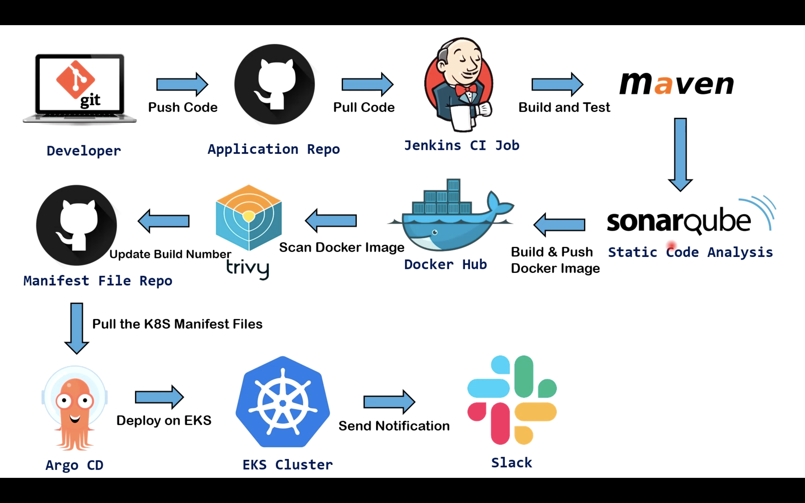

# Jenkins Kubernetes Orchestrator

A project for orchestrating Jenkins pipelines with Kubernetes.

## Project Architecture

## Overview

This repository contains the implementation of a Jenkins-based CI/CD pipeline orchestrated with Kubernetes.

## Features

- Automated CI/CD pipeline
- Kubernetes orchestration
- Scalable architecture
- Efficient resource management

## Getting Started

Instructions for setting up and using this project will be added soon.

## License

This project is licensed under the MIT License - see the LICENSE file for details.
