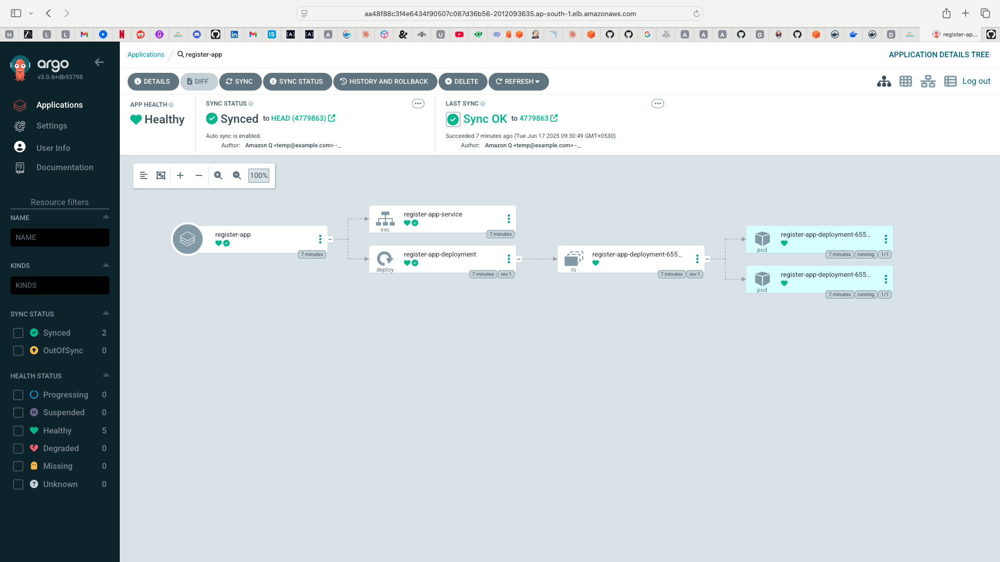

# Jenkins Kubernetes Orchestrator

A comprehensive CI/CD pipeline implementation using Jenkins, Docker, SonarQube, and Kubernetes (EKS) with GitOps methodology using ArgoCD.

## Project Architecture

## Overview

This project demonstrates a complete DevOps pipeline for a Java web application, from code commit to deployment on Kubernetes using GitOps principles. The pipeline includes:

- Continuous Integration with Jenkins
- Code quality analysis with SonarQube
- Container image building and security scanning
- Deployment to Amazon EKS using ArgoCD

## Features

- **Automated CI/CD Pipeline**: Complete automation from code commit to deployment
- **Quality Gates**: SonarQube integration for code quality and security analysis
- **Container Security**: Trivy scanning for vulnerability detection
- **GitOps Methodology**: Infrastructure as Code with ArgoCD
- **Kubernetes Orchestration**: Scalable and resilient application deployment
- **Efficient Resource Management**: Optimized container configurations

## Implementation Details

### 1. Jenkins Setup and Configuration

- Configured Jenkins Master and Agent architecture
- Integrated Maven with Jenkins for Java application builds
- Added GitHub credentials for source code management
- Created pipeline script (Jenkinsfile) for build automation

### 2. SonarQube Integration

- Installed and configured SonarQube server
- Integrated SonarQube with Jenkins pipeline
- Implemented quality gates for code quality assurance
- Set up automated code analysis during CI process

### 3. Docker Integration

- Created Dockerfile for application containerization
- Implemented pipeline stages for Docker image building
- Configured Docker Hub integration for image registry
- Added Trivy scanning for container security

### 4. Kubernetes (EKS) Setup

- Configured bootstrap server for eksctl
- Set up Amazon EKS cluster using eksctl
- Created Kubernetes deployment and service configurations
- Implemented resource management best practices

### 5. ArgoCD Implementation

- Installed ArgoCD on EKS cluster
- Added EKS cluster to ArgoCD for management
- Configured ArgoCD to deploy pods on EKS
- Implemented GitOps workflow with GitHub repository
- Automated ArgoCD deployment using GitOps principles

## Pipeline Workflow

1. **Code Checkout**: Pipeline retrieves code from GitHub repository
2. **Build Application**: Maven builds the Java application
3. **Test Application**: Automated tests are executed
4. **SonarQube Analysis**: Code quality and security scanning
5. **Quality Gate**: Ensures code meets quality standards
6. **Docker Build & Push**: Creates and publishes container image
7. **Security Scan**: Trivy scans image for vulnerabilities
8. **GitOps Update**: Updates deployment manifests in GitOps repo
9. **ArgoCD Sync**: ArgoCD detects changes and deploys to Kubernetes

## Technologies Used

- **Jenkins**: CI/CD orchestration
- **Maven**: Java application build tool
- **SonarQube**: Code quality and security analysis
- **Docker**: Application containerization
- **Trivy**: Container security scanning
- **Amazon EKS**: Kubernetes service for container orchestration
- **eksctl**: EKS cluster management tool
- **ArgoCD**: GitOps continuous delivery tool
- **GitHub**: Source code and GitOps repository

## Getting Started

### Prerequisites

- AWS Account with appropriate permissions
- Jenkins server with required plugins
- Docker installed and configured
- kubectl and eksctl CLI tools
- Access to GitHub repositories

### Deployment Steps

1. Clone this repository
2. Configure Jenkins with required credentials and plugins
3. Set up SonarQube server and create a project token
4. Create an EKS cluster using eksctl
5. Install ArgoCD on the EKS cluster
6. Configure ArgoCD to watch your GitOps repository
7. Run the Jenkins pipeline to initiate the CI/CD process

## Screenshots

### CI Pipeline Execution

### SonarQube Analysis

### ArgoCD Deployment

### Application Deployment

## Repository Structure

- **Jenkinsfile**: Pipeline definition for CI/CD workflow
- **Dockerfile**: Container image definition
- **deployment.yaml**: Kubernetes deployment configuration
- **service.yaml**: Kubernetes service configuration
- **pom.xml**: Maven project configuration
- **webapp/**: Source code for the web application
- **server/**: Server configuration files

## License

This project is licensed under the MIT License - see the LICENSE file for details.

## Author

Created by Anshuman Mohapatra
